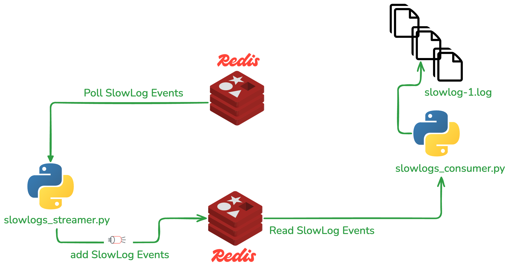
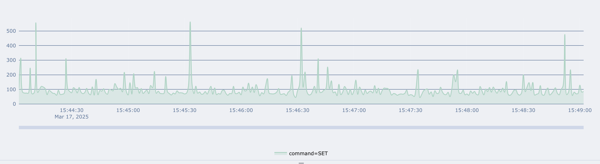

# redis-slowlogs-streamer

* Polls Redis Slow logs into a Redis Stream 
* Consumes the Stream and dumps to parseable log files or to a Redis TSDB

## Objective

Persist Redis SlowLogs on text files so that they can be parsed and ingested using a third party tool for observability purposes. 

## Main Features

* Poll Slowlogs with configurable polling interval and latency threshold
* Streamer allows configurable slowlog latency threshold  (defaults to 10ms) - You can log every command by specifying 0 threshold
* Consumer outputs slow logs to text files to a configurable location with log rotation enabled 
* Consumer outputs slow logs to TSDB 
* Streamer  restores slowlog default settings (threshold and size) before exiting

## Architecture



Multiple Streamers Consumers can be used in parallel to scale out the process to multiple databases and streams.
The Slowlogs Streamer polls slowlogs from a Redis DB and writes them into a stream on a separate Redis Database (dedicated for this task)
The Slowlogs Consumer reads from the Slowlogs Events Stream and writes to text files


## Demo using Docker on a local setup

### create a local network

Open a new terminal and run:

```
docker network create slowlogs-network
```

### Start a local Redis Server used as target Slowlogs analysis

Open a new terminal and run:

```
docker run --rm --name redis_server --network slowlogs-network -p 6379:6379 redis/redis-stack-server:latest
```


### Start a local Redis Server used for Slowlog streams

Open a new terminal and run:

```
docker run --rm --name redis_streams --network slowlogs-network -p 6389:6379 redis/redis-stack-server:latest
```


### Build the consumer and Streamer images 

Open a new terminal and from the project folder run:

```
docker build -t slowlogs-streamer --target logs-streamer .
docker build -t slowlogs-consumer --target logs-consumer .
```

### Start the Streamer agent 

Open a new terminal and run:

```
docker run --rm --name streamer --network slowlogs-network -it slowlogs-streamer:latest -h redis_server -p 6379 -stream_host redis_streams -stream_port 6379 -threshold 0 -ignore slowlog,sping,info
```
This will start the streamer and maintain it until user presses CTRL-C

### Start the Consumer agent 

Open a new terminal and run:

```
docker run --rm --name consumer --network slowlogs-network -v ~/tmp/slowlogs:/tmp/slowlogs -it slowlogs-consumer:latest -h redis_streams -p 6379 -stream redis_server:6379 -outfile -ts
```
### Generate some traffic with memtier-benchmark

Populate the database 10 doc per second for 5 minutes.

Open a new terminal and run:

```
docker run --rm --name memtier --network slowlogs-network redislabs/memtier_benchmark:2.1.3 -s redis_server -p 6379 --hide-histogram --pipeline=1 --threads=1 --clients=1 --rate-limiting=10 --test-time=300 --data-size=20 --ratio=1:0
``` 

Check the Slow logs in  ~/tmp/slowlogs.


## Visualizing the Slow Logs with Time Series 

When using the -ts option on the consumer, a Time Series is created for each command in the Streamer Database.
You can viusualize that time series in Redis Insight using:

```
# visualizing all commands TS
TS.MRANGE 0 +  WITHLABELS AGGREGATION max 100 FILTER series=redis_server:6379 GROUPBY command REDUCE max

# visualizing the KEYS command TS
TS.MRANGE 0 +  WITHLABELS AGGREGATION max 100 FILTER series=re1:12000, command=keys GROUPBY command REDUCE max

```




# Parsing Redis Slowlogs and ingest them to Elasticsearch

This can be  done using  [the redis slow logs parser tool](https://github.com/zumo64/redis-logs-parser). 
You will be able to track command latency in real time and view the percentile latency histogram

## Other Usage Examples

### Starting the slowlog streamer and connect to a target Redis Enterprise database:

```
python slowlogs_streamer.py -c zu743.primary.cs.redislabs.com -h 172.31.43.246 -p 18817 -a redis -stream_port 6389 -threshold 6
```

In this Example: 
The streamer will connect to the Redis Host `172.31.43.246` and port 18817  using `redis` password and stream slowlog events to localhost redis DB on port 6389
Only commands with latency >=6ms are considered
The target stream name will be `zu743.primary.cs.redislabs.com:18817`


### Starting the slowlog streamer and connect to a target Redis CE database:

```
python slowlogs_streamer.py -c zumo.redis.test.localhost -h localhost -p 6379 -stream_host localhost -stream_port 6389 -threshold 6
```

In this Example: 
The streamer will connect to the Redis localhost and stream slowlog events to localhost redis DB on port 6389
Only commands with latency >=6ms are considered
The target stream name will be `zumo.redis.test.localhost:6379`


### Starting the slowlog Consumer script to read the slowlog events and dump events to a folder:
```
python slowlogs_consumer.py -p 6389 -stream zumo.redis.test.localhost:6379 -root_dir /Users/zumo/dev/SupportPackages/Redis-CS -outfile
```

### Start the slowlog Consumer script to read the slowlog events from the beginning of the stream and dump events to a folder
```
python slowlogs_consumer.py -p 6389 -stream zumo.redis.test.localhost:6379 -root_dir /Users/christianzumbiehl/dev/SupportPackages/Redis-CS -z -outfile
```


