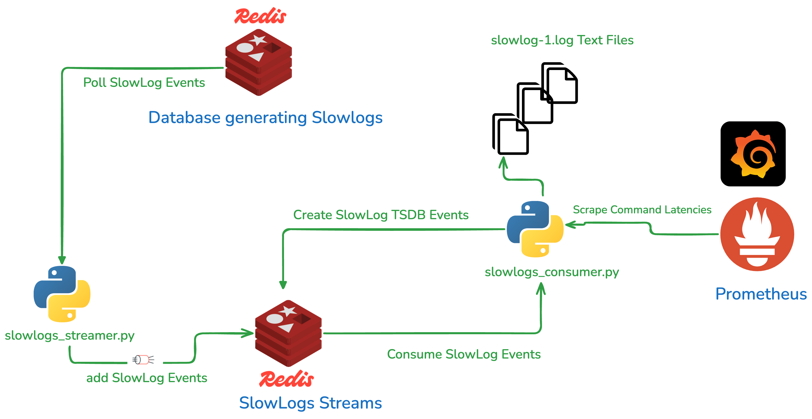

# redis-slowlogs-streamer

Polls Redis Slow logs into parseable log files.

## Objective

Persist Redis SlowLogs on text files so that they can be parsed and ingested using a third party tool for observability purposes. 

## Main Features

* Streamer allows configurable slowlog latency threshold  (defaults to 10ms) - You can log every command by specifying 0 threshold
* Consumer outputs text files to a configurable location with log rotation enabled 
* Streamer  restores slowlog default settings (threshold and size) before exiting

## Architecture



Multiple Streamers Consumers can be used in parallel to scale out the process to multiple databases and streams.
The Slowlogs Streamer polls slowlogs from a Redis DB and writes them into a stream on a separate Redis Database (dedicated for this task)
The Slowlogs Consumer reads from the Slowlogs Events Stream and writes to text files

## How to use
< coming soon >


## Parsing Redis Slowlogs and ingest them to Elasticsearch

This can be  done using  [the redis slow logs parser tool](https://github.com/zumo64/redis-logs-parser). 
You will be able to track command latency in real time and view the percentile latency histogram

## Example usage

### Start the slowlog streamer and connect to a target Redis Enterprise database:

```
python slowlogs_streamer.py -c zu743.primary.cs.redislabs.com -h 172.31.43.246 -p 18817 -a redis -stream_port 6389 -threshold 6
```

In this Example: 
The streamer will connect to the Redis Host `172.31.43.246` and port 18817  using `redis` password and stream slowlog events to localhost redis DB on port 6389
Only commands with latency >=6ms are considered
The target stream name will be `zu743.primary.cs.redislabs.com:18817`


### Start the slowlog streamer and connect to a target Redis CE database:

```
python slowlogs_streamer.py -c zumo.redis.test.localhost -h localhost -p 6379 -stream_host localhost -stream_port 6389 -threshold 6
```

In this Example: 
The streamer will connect to the Redis localhost and stream slowlog events to localhost redis DB on port 6389
Only commands with latency >=6ms are considered
The target stream name will be `zumo.redis.test.localhost:6379`


### Start the slowlog Consumer script to read the slowlog events and dump events to a folder:
```
python slowlogs_consumer.py -h 127.0.0.1 -p 6389 -stream zumo.redis.test.localhost:6379 -root_dir /Users/zumo/dev/SupportPackages/Redis-CS
```

### Start the slowlog Consumer script to read the slowlog events from the beginning of the stream and dump events to a folder
```
python slowlogs_consumer.py -h 127.0.0.1 -p 6389 -stream zumo.redis.test.localhost:6379 -root_dir /Users/christianzumbiehl/dev/SupportPackages/Redis-CS -z True
```

